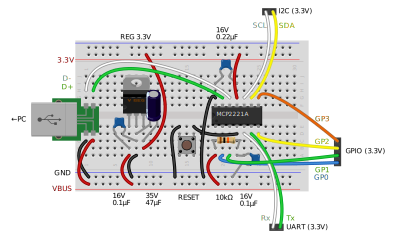
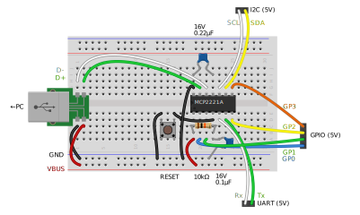

# Wiring
The wiring example of MCP2221.

## Prerequisites
Required devices and parts are as follows:

- USB breakout board or breakout cable
- MCP2221/MCP2221A and
  - 0.22μF capacitor × 1
  - 0.1μF capacitor × 1
  - 10kΩ resistor × 1
- 3.3V voltage regulator (Optional. If you need 3.3V operation.) and
  - external capacitors which required by the regulator
- Push button (Optional. If you want to reset MCP2221/MCP2221A by hand.)

秋月電子通商で購入する場合は、以下で必要なパーツを揃えることができます。　Required parts can be purchased from the following links (Japanese supplier).

  
パーツリスト

- [ＵＳＢ⇔シリアル変換ＩＣ　ＭＣＰ２２２１Ａ－Ｉ／Ｐ](https://akizukidenshi.com/catalog/g/gI-13069/)
- [ＵＳＢｔｙｐｅ－ＣコネクタＤＩＰ化キット（シンプル版エコノミータイプ）](https://akizukidenshi.com/catalog/g/gK-15426/)
- [低損失三端子レギュレーター　３．３Ｖ１Ａ　ＴＡ４８０３３Ｓ](https://akizukidenshi.com/catalog/g/gI-00534/) (外部コンデンサとのセット)
- [積層セラミックコンデンサー　０．２２μＦ５０Ｖ　Ｘ７Ｒ　２．５４ｍｍピッチ　（１０個入）](https://akizukidenshi.com/catalog/g/gP-15936/)
- [絶縁ラジアルリード型積層セラミックコンデンサー　０．１μＦ５０Ｖ２．５４ｍｍ　（１０個入）](https://akizukidenshi.com/catalog/g/gP-00090/)
- [カーボン抵抗（炭素皮膜抵抗）　１／４Ｗ１０ｋΩ　（１００本入）](https://akizukidenshi.com/catalog/g/gR-25103/)
- [タクトスイッチ（黒色）](https://akizukidenshi.com/catalog/g/gP-03647/)

## 3.3V (USB bus power only)
This diagram shows the case where `TA48033S` is used as a 3.3V regulator. If you will attempt to use other regulators, replace capacitors with compliant ones.

## 5V (USB bus power only)

