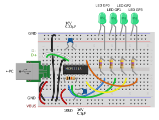

# `blink` (C#)
This example shows the simplest usage of `Smdn.Devices.MCP2221`, how to control GP pins and blink LEDs connected to them.

You can run this example with following instruction.

## Prerequisites
Required devices and parts are as follows:

- PC with USB ports and
  - OS with USB-HID
  - .NET SDK
- MCP2221/MCP2221A and
  - resistors, capacitors, USB breakout and some accessory parts. (See [/doc/wiring](/doc/wiring#prerequisites) for detail)
- LEDs and resistors with appropriate values, ×10Ω(□□🟫□) or ×100Ω(□□🟥□)

## Wiring up
Wire up the devices and parts as shown in the wiring diagram below.



## Build and run project
Run command `dotnet build` to build project, or `dotnet run` to run project.

If the project run properly, this project and circuit blinks LEDs like below:


[](https://www.youtube.com/watch?v=MnIunESm71E)

### Visual Basic version
This example is written in C#. For Visual Basic version, see [blink-visualbasic](../blink-visualbasic).


## Next step
To learn more usage of `Smdn.Devices.MCP2221`, see [Smdn.Devices.MCP2221 examples](../../Smdn.Devices.MCP2221/) directory.


To use device bindings from `Iot.Device.Bindings` with MCP2221/MCP2221A, see [Smdn.Devices.MCP2221.GpioAdapter examples](../../Smdn.Devices.MCP2221.GpioAdapter/) directory.

If you want to use `Smdn.Devices.MCP2221` in your project, create project and add package `Smdn.Devices.MCP2221` to the project. Add `Smdn.Devices.MCP2221.GpioAdapter` also if you want to use device bindings from `Iot.Device.Bindings`.

```
dotnet new console --name your-project
cd your-project/
dotnet add package Smdn.Devices.MCP2221
dotnet add package Smdn.Devices.MCP2221.GpioAdapter
```
